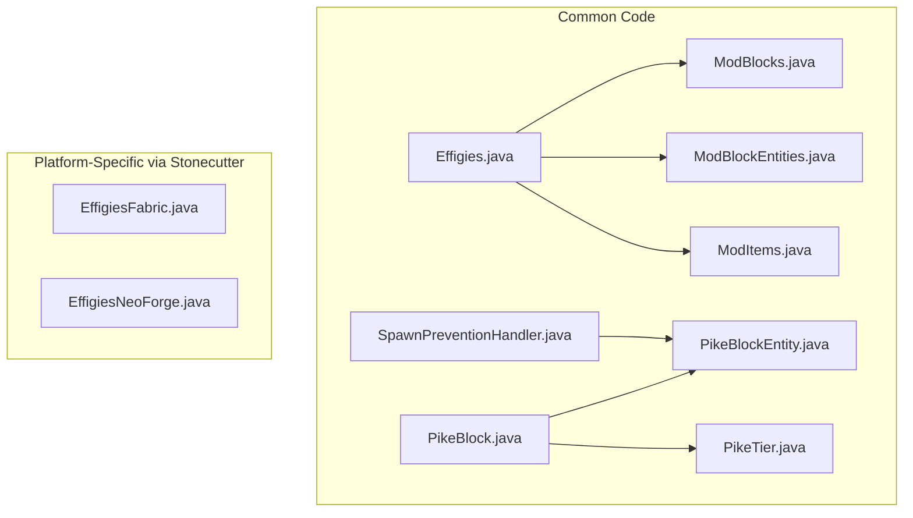

# Effigies Mod Implementation Plan

## Overview

Implement Pike blocks (Wooden and Stone tiers) that can be placed and activated with vanilla mob heads to prevent spawns of that mob type within a chunk-based radius. Uses Stonecutter preprocessor for Fabric/NeoForge cross-compatibility.

## Architecture



## Phase 1: Fix Existing Configuration Issues

**[neoforge.mods.toml](src/main/resources/META-INF/neoforge.mods.toml)** has errors from previous mod:

- Line 12-13: Description references "gentle, mindful reminders" - needs update to Effigies description
- Lines 16-28: Dependencies use `[[dependencies.gentlereminders]]` instead of `[[dependencies.effigies]]`

**Missing LICENSE file**: Referenced in `build.gradle.kts` line 131 but doesn't exist - create MIT LICENSE

## Phase 2: Core Java Implementation

### Directory: `src/main/java/jackperry2187/effigies/`

| File | Purpose |

|------|---------|

| `Effigies.java` | Main mod class with common initialization, constants |

| `PikeTier.java` | Enum defining tiers (WOODEN=0, STONE=1 chunk radius) with easy extension for 5 more |

| `block/PikeBlock.java` | Pike block with cross shape, right-click activation logic, head storage |

| `block/entity/PikeBlockEntity.java` | BlockEntity storing: activated state, head type (EntityType) |

| `registry/ModBlocks.java` | Block registration using Stonecutter conditionals |

| `registry/ModBlockEntities.java` | BlockEntity type registration |

| `registry/ModItems.java` | BlockItem registration for pikes |

| `SpawnPreventionHandler.java` | Checks active pikes and cancels mob spawns within radius |

### Platform Entry Points (using Stonecutter `//? if fabric/neoforge`)

| File | Purpose |

|------|---------|

| `fabric/EffigiesFabric.java` | Fabric `ModInitializer`, registers with Fabric API events |

| `fabric/EffigiesClientFabric.java` | Fabric `ClientModInitializer`, registers render layers |

| `neoforge/EffigiesNeoForge.java` | NeoForge `@Mod` class, registers with NeoForge event bus |

### Spawn Prevention Logic

- **Fabric**: Hook into `ServerLivingEntityEvents.ALLOW_SPAWN` from Fabric API
- **NeoForge**: Subscribe to `MobSpawnEvent.PositionCheck` event
- **Logic**: On spawn attempt, search for active PikeBlockEntities within chunk radius that match the entity type, cancel if found

### Radius Calculation (per README)

```java
public enum PikeTier {
    WOODEN(0),   // Current chunk only (1 chunk)
    STONE(1),    // +1 radius = 3x3 = 9 chunks
    // Future tiers: COPPER(2), IRON(4), GOLD(6), DIAMOND(8), NETHERITE(16)
}
```

## Phase 3: Resources

### Block Models (cross shape like sugar cane)

**`assets/effigies/models/block/pike_wooden.json`**:

```json
{
  "parent": "minecraft:block/cross",
  "textures": { "cross": "effigies:block/pike_wooden" }
}
```

### Blockstates

**`assets/effigies/blockstates/wooden_pike.json`**:

```json
{
  "variants": { "": { "model": "effigies:block/pike_wooden" } }
}
```

### Item Models

**`assets/effigies/models/item/wooden_pike.json`**:

```json
{
  "parent": "effigies:block/pike_wooden"
}
```

### Language File

**`assets/effigies/lang/en_us.json`**:

```json
{
  "block.effigies.wooden_pike": "Wooden Pike",
  "block.effigies.stone_pike": "Stone Pike"
}
```

## Phase 4: Build Verification

Run Stonecutter build commands:

- `./gradlew chiseledBuild` - Builds all versions (both loaders)
- Verify JARs produced in `versions/*/build/libs/`

## Key Implementation Notes

1. **Mob Head Detection**: Use `item.getItem() instanceof SkullItem` and map to EntityType via NBT/component data
2. **Activation Visual**: Pike block state can include `activated` boolean property for potential future visual changes
3. **Breaking Behavior**: Override `onBreak` to drop both Pike item and stored head item
4. **Shift+Right-Click**: Remove head without breaking pike (check `player.isSneaking()`)
5. **Render Layer**: Register as `RenderLayer.getCutout()` for transparent texture parts

## Files Summary

```
src/main/java/jackperry2187/effigies/
├── Effigies.java
├── PikeTier.java
├── SpawnPreventionHandler.java
├── block/
│   ├── PikeBlock.java
│   └── entity/
│       └── PikeBlockEntity.java
├── registry/
│   ├── ModBlocks.java
│   ├── ModBlockEntities.java
│   └── ModItems.java
├── fabric/
│   ├── EffigiesFabric.java
│   └── EffigiesClientFabric.java
└── neoforge/
    └── EffigiesNeoForge.java

src/main/resources/assets/effigies/
├── blockstates/
│   ├── wooden_pike.json
│   └── stone_pike.json
├── models/
│   ├── block/
│   │   ├── pike_wooden.json
│   │   └── pike_stone.json
│   └── item/
│       ├── wooden_pike.json
│       └── stone_pike.json
└── lang/
    └── en_us.json
```